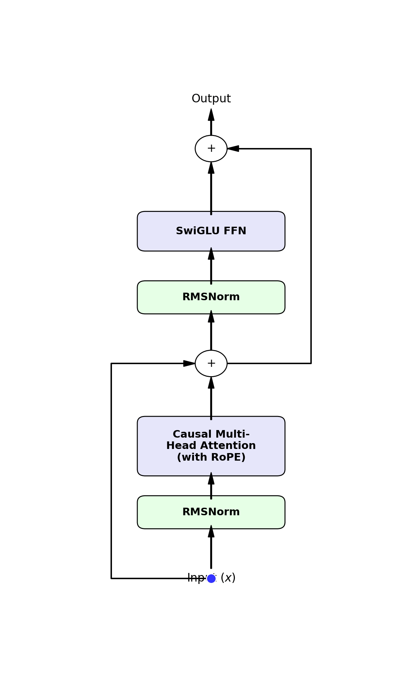

# TinyDTVi-500M: Pretraining a Compact Vietnamese Language Model from Scratch
TinyDTVi is a ~500M parameter causal language model pretrained entirely from scratch on a single consumer-grade GPU (NVIDIA RTX 3080 12GB). 
This repository contains the core codebase for reproducing the model architecture, training loop, and data preparation pipeline.

**Paper:** [arXiv link coming soon]
**Model Weights (283,200 steps):** [hoangduy02071997/tinyDTVi](https://huggingface.co/hoangduy02071997/tinyDTVi)
**Pretraining Dataset:** [hoangduy02071997/tinyDTVi-dataset](https://huggingface.co/datasets/hoangduy02071997/tinyDTVi-dataset)

## Architecture Highlights


- **Base Architecture:** Decoder-only Transformer (nanoGPT-inspired)
- **Parameters:** ~509 Million
- **Layers:** 24 | **Heads:** 16 | **Embed Dim:** 1088
- **Context Length:** 1024 tokens
- **Modernizations:**
  - RMSNorm (Pre-Layer Normalization)
  - SwiGLU Activations
  - Rotary Position Embeddings (RoPE)
  - No biases in linear layers
  - Tied embeddings

## Repository Structure
- `tinyDTVi_model.py`: Model architecture definition (Transformer, Blocks, Attention with RoPE, SwiGLU).
- `train_tinyDTVi.py`: The main pretraining loop featuring 8-bit AdamW, Gradient Checkpointing, and bfloat16 mixed precision.
- `cleanup_v2.py` & `clean_utils.py`: The aggressive whitelist-based data filtering and bounded prefix-based deduplication pipeline used to process over 200GB of raw text.
- `prepare_data.py`: Script to tokenize the cleaned 134GB text corpus into binary format (`train.bin`, `val.bin`) for training.
- `train_tokenizer.py`: Script to train our custom highly-compressed 50,304-token Vietnamese Byte-Pair Encoding (BPE) tokenizer.
- `benchmark_tokenizer.py`: Script evaluating tokenizer compression efficiency against multilingual models (Qwen2.5, Llama-3, etc.).
- `eval_ppl.py`: Validation script to measure Perplexity (PPL) on held-out data.
- `benchmark_bpc.py`: Script to compute Bits-Per-Character (BPC) on the XQuAD dataset for language modeling evaluation.
- `inference.py`: Script for qualitative text generation (Top-k sampling).

## Quick Start (Inference)
First, install the requirements:
```bash
pip install -r requirements.txt
```

To run text generation using the pretrained model:
```bash
# Note: Ensure you have downloaded the weights from Hugging Face
python inference.py
```

## Training Setup
We successfully trained this model on a single RTX 3080 (12GB VRAM). The training heavily relies on memory-bound optimizations. To reproduce the training environment, we recommend using Docker with PyTorch 2.1.2.
For detailed hardware configurations, please refer to Section 5.1 of our paper.

## Citation
If you use this codebase or model in your research, please cite our paper:
```bibtex
@article{tinyDTVi2026,
  title={TinyDTVi: Pretraining a Compact Vietnamese Language Model from Scratch Under Consumer-Grade Constraints},
  author={Duy Hoang and Duy Tam Hoang Nguyen},
  year={2026}
}
```
